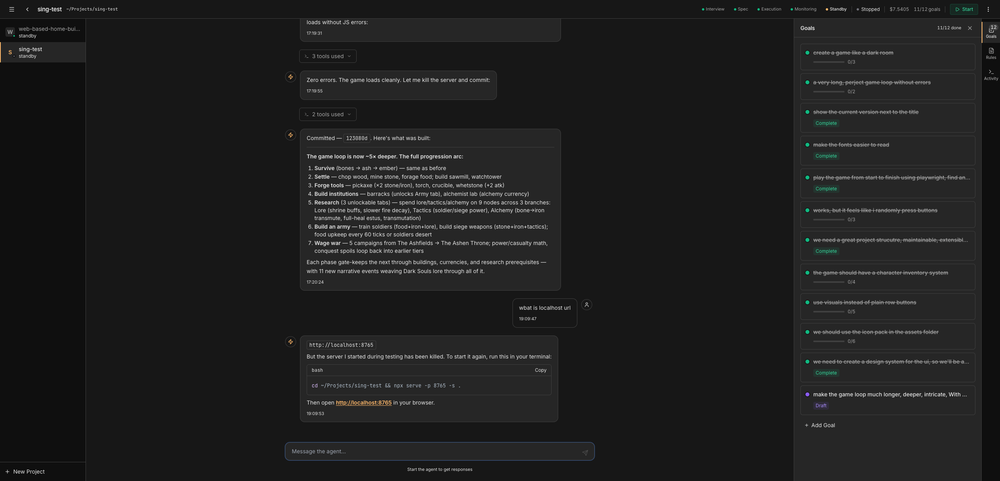
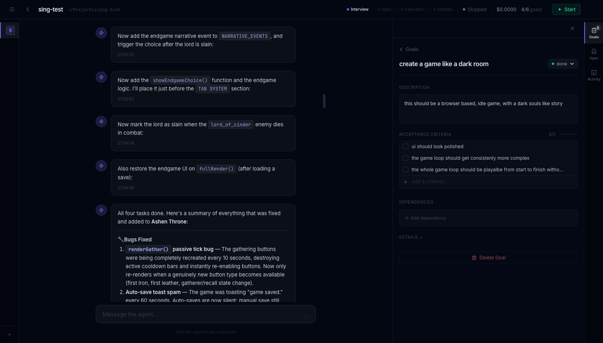
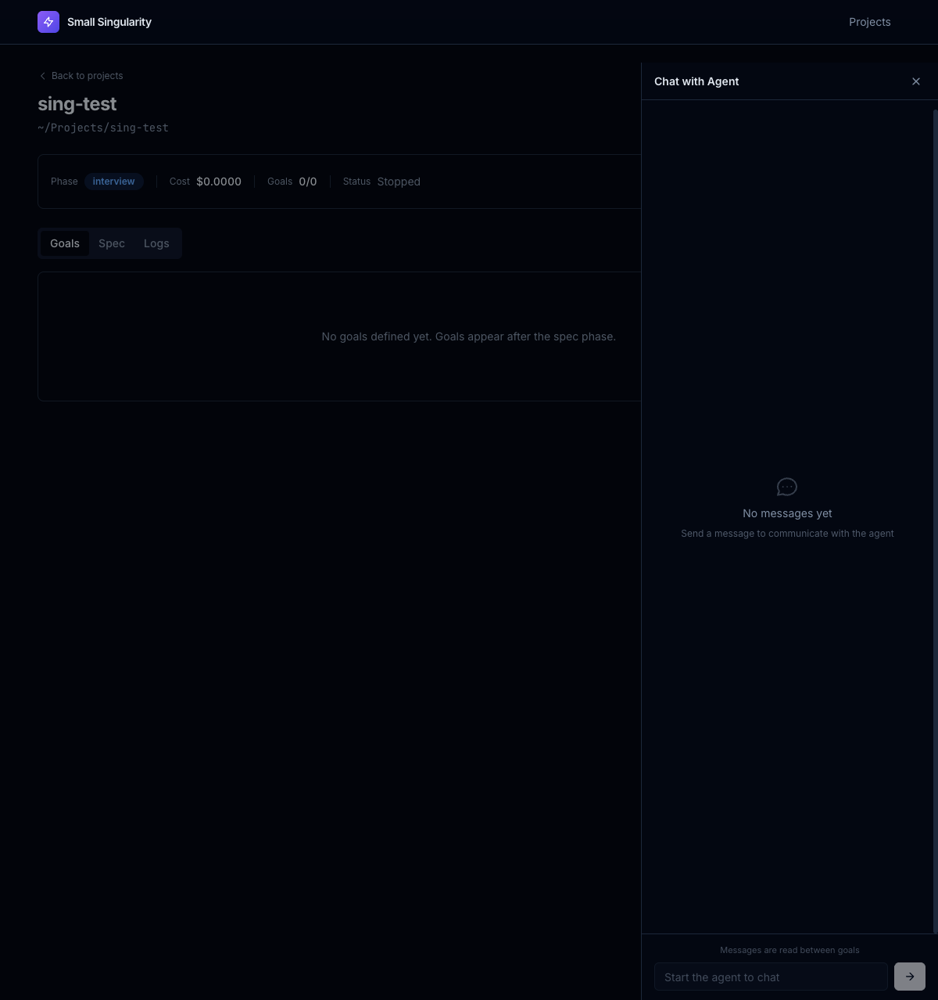

<h1 align="center">AutoGoals</h1>

<p align="center">
  A goal-driven autonomous development platform.<br/>
  Define what you want built. AI agents continuously plan, code, and verify it.
</p>

<p align="center">
  
</p>

---

## What is AutoGoals?

AutoGoals is an open-source platform that manages autonomous AI coding agents. You define goals for your project, and AI agents continuously work on them: planning approaches, writing code, running verifications, committing checkpoints, and moving to the next goal. All managed through a real-time dashboard.

It uses [Claude Code SDK](https://github.com/anthropics/claude-code-sdk) under the hood, giving each agent a fresh context window per task to prevent quality degradation over long sessions.

---

## Features

### Goal-Driven Execution
Define goals with acceptance criteria. The agent picks them up, implements them, verifies completion, and auto-commits a checkpoint.

<p align="center">
  
</p>

### Two Planning Modes
**Interview** — the agent analyzes your codebase, asks targeted questions with clickable options, and builds a spec from your answers. **Auto-Plan** — the agent decides everything and starts working immediately.

### Real-Time Chat
Talk to your running agent. See tool usage, file edits, and progress in real time. Send messages to redirect the agent or ask questions.

<p align="center">
  
</p>

### Rules System
Define global rules (applied to every project) and project-specific rules. Agents must follow all rules. Periodic compliance checks catch violations automatically.

### Process Management
Start, stop, and monitor dev servers directly from the dashboard. Auto-detect commands from package.json and Makefile. Port detection with one-click "Open in Browser".

### Git Checkpoints
Every completed goal gets an automatic git commit with an AI-generated summary. Restore to any checkpoint from the History panel.

### Recurring Goals
Mark goals as recurring and the agent re-executes them every cycle. Useful for continuous testing, linting, or monitoring tasks.

---

## Architecture

```
packages/
  core/       — Shared types, SQLite state store, AgentSession wrapper
  api/        — GraphQL API server with WebSocket subscriptions
  dashboard/  — React + Vite + Tailwind dashboard
  cli/        — Standalone terminal interface
  docs/       — System visualization app
```

**Tech stack:** TypeScript, React, GraphQL (Apollo), SQLite, Claude Code SDK, Tailwind CSS, shadcn/ui

---

## Quick Start

### Prerequisites
- Node.js 20+
- pnpm
- [Claude Code CLI](https://docs.anthropic.com/en/docs/claude-code) installed and authenticated

### Install & Run

```bash
git clone https://github.com/ozankasikci/autogoals.git
cd autogoals
pnpm install

# Terminal 1: API server
cd packages/api && pnpm dev

# Terminal 2: Dashboard
cd packages/dashboard && pnpm dev
```

Open `http://localhost:5173` and create your first project.

---

## How It Works

1. **Create a project** — point it at a directory on your filesystem
2. **Add goals** — describe what needs to be built
3. **Choose a planning mode** — Interview (agent asks questions) or Auto-Plan (agent decides)
4. **Start the agent** — it continuously works through goals in priority order
5. **Chat and steer** — send messages to redirect, clarify, or ask questions
6. **Review and approve** — refined goals need your approval before execution starts

The agent runs a continuous supervisor loop:
- Check for user messages
- Refine draft goals (interview or auto-plan)
- Execute the next pending goal with a fresh context
- Verify completed goals
- Check rules compliance
- Sleep and repeat

---

## Key Concepts

| Concept | Description |
|---------|-------------|
| **Goals** | Units of work with name, description, approach, and acceptance criteria |
| **Rules** | Constraints the agent must always follow (global or per-project) |
| **Planning modes** | Interview (interactive Q&A) or Auto-Plan (fully autonomous) |
| **Fresh context** | Each goal execution gets a clean agent session to prevent context rot |
| **Recurring goals** | Goals that re-execute every cycle (testing, linting, monitoring) |
| **Checkpoints** | Auto-commits after each goal with AI-generated summaries |

---

## License

MIT
